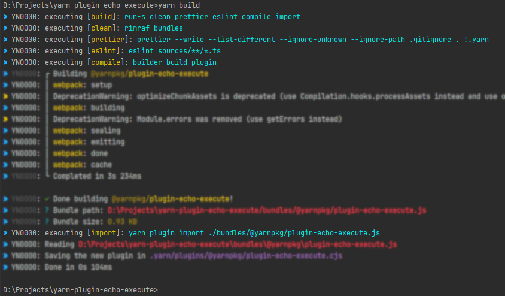

# About

Echoes a `package.json` script's commandline before Yarn executes it. This patches the design decision in Yarn v2 to
omit the commandline echo that traditionally occurs before execution. An official setting to restore this behavior
natively will not be implemented: see [#1215](https://github.com/yarnpkg/berry/issues/1215).

## Discretion

The main motivation for this design decision in Yarn v2 is compatibility with tools that parse console output from other
tools: test report scanners, JSON readers, etc. Using `yarn-plugin-echo-execute` is thus not recommended if your project
includes tools that parse console output. If such a tool fails while this plugin is enabled, verify that it isn't the
cause before contacting the Yarn developers for support.

# Acquiring

Since updates are rare, the script is simply built locally and [committed](./bundles/@yarnpkg/plugin-echo-execute.js).
Install it in your project using either of the following:

- `yarn plugin import https://yarnplugins.com/echo-execute` (recommended)
- `yarn plugin import https://raw.githubusercontent.com/leaumar/yarn-plugin-echo-execute/master/bundles/%40yarnpkg/plugin-echo-execute.js`

## Building

1. `yarn install`
2. `yarn build`
3. run `yarn plugin import path/to/./bundles/@yarnpkg/plugin-echo-execute.js` in your target project(s)
4. profit

# Maintaining

## Setup

`yarn install`

## Iterative changes

1. develop
   1. make changes
   2. `yarn cycle` to see changes in action
   3. repeat
2. `yarn build` to run all checks
3. commit updated **sources**

## Release

1. `yarn build` to run all checks and build artifacts
2. commit updated **artifacts**
3. add sequential `release-n` tag
4. party
